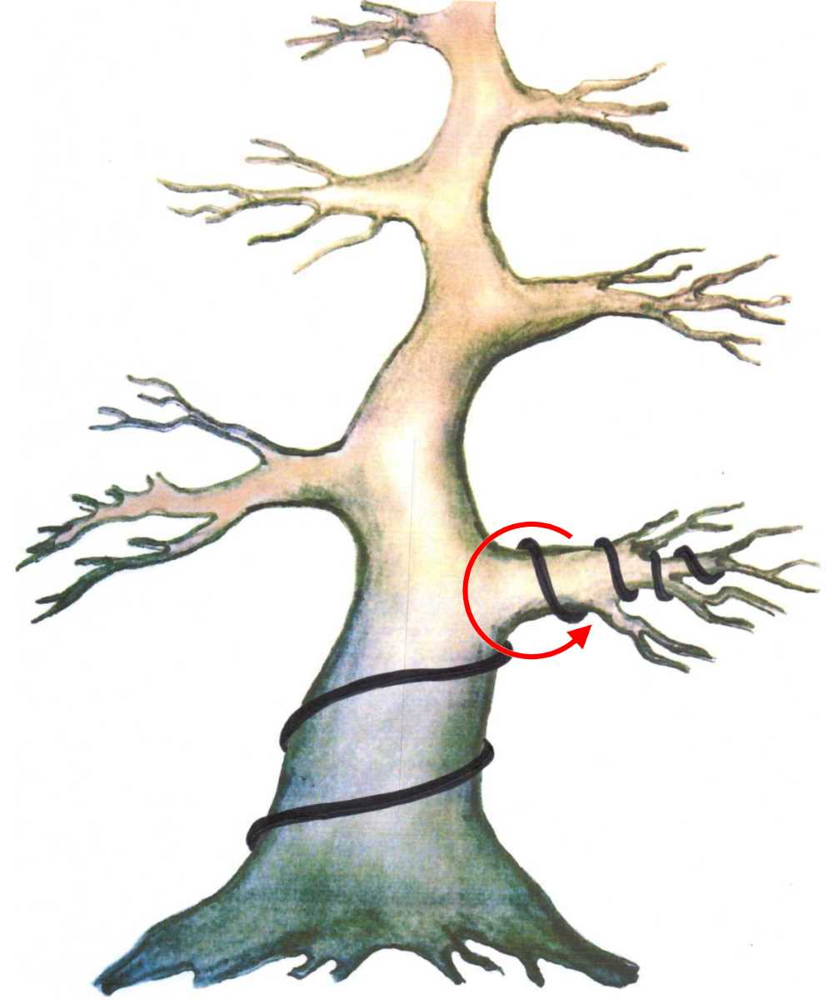

# Bonsai Guide

## Introduction

This is a WIP guide to all things bonsai! Being a noobie myself, my aim is to update this whenever I learn information that will be pertinent to my growth as a bonsai cultivar as well as you :wink:

---

<br />

## Table of Contents

### [Bonsai Forms](#bonsai-forms)

### [Growing Bonsai](#growing-bonsai)

### [Training Bonsai](#training-bonsai)

<br />
<br />

# Bonsai Forms

<a id="bonsai-forms"></a>
Although all bonsai are simply trees that are miniautre (meaning that they grow upright), there are certain forms that can be attributed to unique styles/names.
<br />
<br />


<br />
<br />

```
One of the main characteristics of bonasi is the idea that the foliage will start wide and taper off to a point; forming a triangle shape.

Depinding on the form a bonsai may take, this general rule is followed either in the overall branch structure, or in each foliage bunch.

In addition, the leaf structure of all bonsai forms can be seen to be in levels (i.e. there is clear vertical separation between branches)

Another proponent that make a bonsai tree bonsai is the bare branch structure / tall and easily visible trunk. The beauty in bonsai lies in being able to identify the trees structure and form.
```

- ## Upright

  This is one of the traditional and strightforward bonsai forms. It's main characteristic is that it tapers off from wide to short in its leaf structure. It also can have a trunk that tapers off as well to add to the triangle silhouette

  Examples:

<span style="display: flex; align-items: center">
  
  
</span>

<br />

- ## Informal Upright/Slanted

  Informal Upright / Slanted is very similar to formal upright, but, as the name implies, is slanted / slightly curvy. This brings some movement to the tree that some people find very interesting

  **Note: informal varies from twisted by the fact that informal still conforms to a stright/ somewhat balanced line, while twisted may not have any sense of unity or continuity**

  Examples:

<span style="display: flex; align-items: center">
  
  
</span>

<br />

# Growing Bonsai

<a id="growing-bonsai"></a>
Although deciding on a bonsai form is very important in how you go about caring for the tree, growing it is obviously paramount! You can have a beautiful bonsai if its dead :grimacing:

<br />

### Pruning / Sacrificial Branches

When it comes to bonsai, throughout your journey the idea of having "sacrificial branches" will come about a lot. In fact, many of the branches will be pruned until the desired shape of the tree is reached. There will come times where you purposefully grow out branches just to prune them back, and this is beneficial for a multitule of reasons.

    Growing out branches can aid in thickening of the trunk

    Growing out sacrificial  branches can allow for the thickening of the branches that are used for the final form of the tree.

    Additionally, wherever the prune of the sacrifical branch happens, growths will shoot out from the cut at the next bud (called dieback), allowing for the tree to look more full

In addition to sacrifical branches, regular pruning to keep the overall tidiness and form of the bonsai tree is needed. This type of pruning can involve pruning, sucker branches, branches that come back towards the tree, branches that compete with the main trunk, etc.


<br />

### Soil

The best type of soil for bonsai is one that aerates as well as it holds enough water and nutrients to properly feed the tree. Although, generally speaking, any soil that is well draining is good enough for plants/bonsai trees, the best ingredients for a bonsai mix are inclide akadama, pumice, lava rock, and peat moss.

There are generic mixes that serve most bonsais well, but you can also be more specific in the makeup/proportions of each of these ingredients based on the type of bonsai tree that you have. [Learn more here](https://www.bonsaiempire.com/basics/bonsai-care/bonsai-soil#:~:text=The%20most%20common%20components%20for,gravel%20also%20known%20as%20grit.)

There are plenty of soil makeups that bonsai masters have been known to use that serve them well (soil including crushed granite, charcoal, etc), so learn more about the type of tree that you are taking care of and see if there are specific compositions to maximize the health and happiness of your tree!

<br />

### Nebari

When growing a bonsai tree there is a practice of flaring out the surface roots in a radial fashion called nebari.

Examples:

<span style="display: flex; align-items: center">
  
  
</span>

<br />
<br />

# Training Bonsai

<a id="training-bonsai"></a>
Argubly the most impactful part of raising bonsai tree is how it is trained. There are many techniques and rules of thumb when training bonsai

## Wiring

In order to achieve the bends, twists, and curves many famous bonsai tree have, they were "trained" using wires. These wires are normally either copper or aluminum. Depending on the type of tree/ strength of the tree, aluminium may be preferred over copper, and vice versa. In general, aluminium is better for deciduous tree, and copper for conifers and pines, but overall aliminium is good enough when just starting out.

Training bonsai is normally a process that takes years to get the desired effect and has to watched to make sure that the wires are still strong enough to bend the branches / they are not digging into the tree.

When choosing a thickness of wire, a general rule of thumb is that the wire should be about a 1/3 of the thickness of the branch you are wiring.

    Tip: If you took a piece of wire and pushed it against the branch you wish to train and the wire bends but the branch does not, the wire is not thick enough.

    This is a delicate process as you don't want to use a wire so thick that would damage/break branches when trying to bend, as well as one not too thin that won't hold its shape against the tree

The thickness of wire usually ranges from 1mm-8mm, with the strength of the wire respective to its thickness.

    The strength/ rididity of the wire is said to be roughly the diameter of the wire to the power of 4 (i.e. a 2mm wire would have a rigidity of about 16; 2^4 = 16)

When wiring a branch, you want to make sure you wire at a 45 degree angle **towards** the direction you want to bend / twist. You also want to make sure you anchor the wire well to provide enough resistance to properly bend the branch. There are two main ways to do this:

### Via Similar branch


### Via Trunk

<span style="display: flex; align-items: center">
  
  
</span>

<br />

There is the method of pulling down a branch via anchor and tension if wiring it directly isn't enough to properly shape it. Normally, a piece of protective material is placed on the branch before tensionining to mitigate damage to it.


<br />
<br />

---

Bonsai is an art form and should show your personality so don't be afraid to be expressive! At the end of the day these are plants that are pretty malleable and resilient. You got this!

<br />

# Resources
